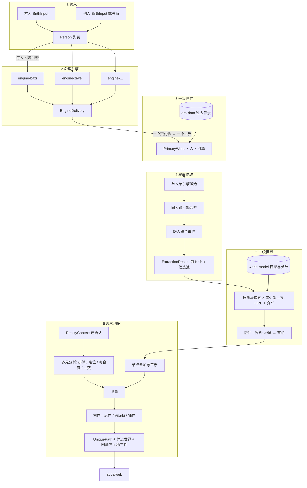

# 01 · 架构设计

## 0. 结论先行

- 采用你提出的分层，依赖单向向下。我**增加了三个模块**：`detmath`（确定性数学与规范序列化，放在最底层）、`rule-registry`（规则登记表，作为数据包）、`era-data`（时代与地域数据集，作为数据包）。另外把「选择目录」等【自定】的映射表集中放在 `world-model/catalog` 下，统一版本化。
- 用 **pnpm workspace 的 monorepo**，每层一个包。包之间的依赖写在各自的 `package.json` 里，pnpm 的严格模式不允许使用未声明的依赖，所以「只能依赖下层」由包管理器和一条 lint 规则共同强制，而不是靠约定（包管理器的选择是 10 文档 D12，待确认）。
- **计算在浏览器的 Web Worker 中进行**，第一版不需要服务端计算，也不需要 WASM。确定性的风险来自 `Math.exp` 等函数在不同 JavaScript 引擎上的结果不保证逐位相同，所以算法路径中禁止直接使用它们，统一用 `detmath`。

## 1. 分层与模块边界

```
层  包名                      职责                                              允许依赖
──  ────────────────────────  ────────────────────────────────────────────────  ─────────────────────
L0  @hpulse/detmath           确定性的 exp/log/sqrt/σ、规范十进制、canonicalJson、  无
                              SHA-256、稳定排序、种子派生
L1  @hpulse/contracts         全部 Zod schema 与类型（02 文档）                    detmath
L2  @hpulse/astro-time        IANA 历史时区、儒略日、真太阳时、节气、公历农历互转、    contracts, detmath
                              干支、行星位置（封装 astronomy-engine、lunar-typescript）
L2  @hpulse/rule-registry     规则登记表（数据 + 校验 + 查询）                     contracts
L2  @hpulse/era-data          时代与地域数据集（数据 + 查询）                       contracts
L3  @hpulse/engine-<id>       每个引擎一个包，纯函数：(Person, AstroContext) →      contracts, detmath, astro-time,
                              EngineDelivery。引擎之间互不依赖                     rule-registry
L4  @hpulse/world-model       状态定义、状态转移、选择目录、ChoiceTypeMap、          contracts, detmath, era-data
                              JointEventRules、参数集
L5  @hpulse/worlds            一级世界：EngineDelivery → PrimaryWorld               contracts, world-model
L6  @hpulse/choices           权重提取：PrimaryWorld[] → ExtractionResult           contracts, detmath, world-model
L7  @hpulse/multiverse        二级世界：阶段博弈、QRE、穷举、地址与 nodeAt           contracts, detmath, world-model
L7  @hpulse/reality           现实情境的校验、规范化、匹配核、冲突判定               contracts, detmath, world-model
L8  @hpulse/collapse          叠加、测量、前向—后向、Viterbi、抽样、稳定性、PathDiff  contracts, detmath, world-model,
                                                                                  multiverse, reality
L9  @hpulse/pipeline          唯一编排入口 runAnalysis(AnalysisRequest) →           以上全部（含所有 engine 包）
                              PipelineResult；永不抛异常；缓存
L10 apps/web                  React 界面，只消费 PipelineResult；Web Worker 中      pipeline, contracts
                              运行 pipeline
L10 apps/web/native           Capacitor 外壳（android/、ios/）                      apps/web 的构建产物
L11 supabase/                 鉴权、Postgres、Edge Functions（AI 解读、删户）        独立；只通过 contracts 的
                                                                                  JSON schema 对齐数据形状
dev @hpulse/testkit           黄金用例加载、属性测试生成器、暴力枚举对照器            仅 devDependencies
```

### 与你的初步想法的差异及理由

| 你的设想 | 我的调整 | 理由 |
|---|---|---|
| 最底层是 `contracts` | 在其下加 `detmath` | 字节级确定性需要规范的数值格式和可移植的超越函数，契约本身的序列化就依赖它 |
| 规则来源写在各引擎内 | 独立的 `rule-registry` 数据包 | 规则 ID 和来源要能被 CI 统一校验，被界面统一展示，被黄金用例引用；放在引擎里会形成 13 份格式各异的登记 |
| 时代数据未指定位置 | 独立的 `era-data` 数据包 | 数据有自己的版本和许可，更新节奏与代码不同 |
| `reality` 在 `multiverse` 之后 | `reality` 与 `multiverse` 同层、互不依赖 | 现实情境的校验和匹配核只需要世界模型，不需要二级世界；把两者放同层能让它们并行开发和测试 |
| `backend` 作为第 12 层 | `supabase/` 保持独立，不依赖前端包 | Edge Functions 运行在 Deno，不应引入前端构建链；数据形状由 contracts 导出的 JSON Schema 对齐 |

### 依赖规则如何强制

1. 每个包的 `package.json` 只声明允许的依赖；pnpm 严格模式下未声明的包无法 import。
2. ESLint 规则（`eslint-plugin-boundaries` 或 `dependency-cruiser`，实施时二选一）再按上表检查一遍，并禁止 `engine-*` 之间互相 import。
3. 算法包（L0–L9）禁止使用：`Math.random`、`Date.now`、无参 `new Date()`、`Intl.*`、`toLocaleString`、`Math.exp/log/pow/sin/cos/tan/atan2`（必须走 `detmath`；`astro-time` 内部封装第三方天文库时例外，见 §4）。由静态扫描脚本在 CI 中强制。
4. 算法包禁止 import React、Supabase 客户端、浏览器全局对象。

## 2. 目录结构

```
/
├── CLAUDE.md
├── package.json                 # workspace 根，只有脚本
├── pnpm-lock.yaml               # 唯一锁文件
├── pnpm-workspace.yaml
├── packages/
│   ├── detmath/
│   ├── contracts/
│   ├── astro-time/
│   ├── rule-registry/
│   │   └── rules/<engineId>.yaml        # 规则登记数据
│   ├── era-data/
│   │   └── data/<regionCode>/<decade>.json
│   ├── engines/
│   │   ├── bazi/  ziwei/  western/  ...  # 每个引擎一个包
│   ├── world-model/
│   │   └── catalog/                      # choice-catalog.yaml, choice-type-map.yaml, joint-event-rules.yaml, params/2026.1.yaml
│   ├── worlds/  choices/  multiverse/  reality/  collapse/  pipeline/
│   └── testkit/
├── golden/                      # 独立黄金用例（只读数据，来自外部）
│   ├── astro-time/  bazi/  ziwei/  ...
│   └── SOURCES.md               # 每批数据的来源、取得日期、取得人
├── snapshots/                   # 回归快照（代码自己生成，与 golden 分开计数）
├── apps/
│   └── web/                     # React + Vite；含 android/、ios/（Capacitor）
├── supabase/
│   ├── migrations/
│   └── functions/
├── docs/
│   └── rebuild/                 # 本套设计文档
└── legacy/                      # 第 0 阶段从 src/ 移入的旧代码，只读参考，不参与构建与检查，逐批删除
```

## 3. 六段式数据流



用户没有提供现实情境时，管线在第 5 段结束，返回 `stage: 'awaiting_reality'`，界面引导用户补充现实情境。

## 4. 计算放在哪里，对确定性有什么影响

**计算量估计**（04、05 文档）：引擎 8 人 × 13 引擎约 100 次纯计算；二级世界与坍缩是动态规划，K = 12、可达状态数百、每节点策略组合 ≤ 48、每引擎一次 QRE 迭代 500 步。粗估单次完整分析在现代手机上为亚秒到数秒级（这是估计，第 4 阶段实测后修正）。

| 方案 | 优点 | 代价 | 结论 |
|---|---|---|---|
| 主线程 | 最简单 | 界面卡顿 | 不采用 |
| **Web Worker（推荐）** | 不卡界面；出生信息和现实情境不必离开设备即可计算 | 需要消息序列化 | **第一版采用** |
| WASM（Rust） | 数值行为在各平台一致 | 需要维护两种语言的算法；现有 Rust 只有输入归一化 | 不采用（10 文档 D8） |
| 服务端（Edge Function） | 统一运行环境 | 敏感数据离开设备；计算成本 | 只在 K 很大或人物很多、手机算不动时作为备选 |

**确定性的具体风险与对策**：

1. **JavaScript 中只有 `+ − × ÷` 由规范保证按 IEEE 754 正确舍入。** `Math.exp`、`Math.log`、`Math.sin` 等在 ECMAScript 规范中是「由实现近似」的（`Math.sqrt` 在主流引擎上实际是正确舍入的，但我没有核实规范是否作此保证，按不保证处理），不同浏览器引擎（V8、JavaScriptCore、SpiderMonkey）可能在最后一位不同。所以 `detmath` 用只含四则运算的固定步骤算法实现这些函数（包括 sqrt），并在测试中与高精度参考值比对。
2. **第三方天文库**（`astronomy-engine`）内部使用 `Math.sin` 等函数。它的输出在 `astro-time` 中统一量化：角度保留到 1e-9 度，时刻保留到毫秒。在规则判定的边界附近（例如出生时刻离节气交接不到 1 分钟），引擎打标 `ambiguous_input` 而不是悄悄选一边。
3. **集合遍历**：所有 Map/Set 的遍历都先按规范键排序；对象键序依赖 `canonicalJson`。
4. **跨运行环境检验**：CI 在 Node（V8）中跑全部测试；另用 Playwright 在 Chromium 中跑一组「输出哈希」测试；WebKit 和 Firefox 的同类测试在环境具备时加入（当前云环境只预装了 Chromium）。

## 5. 缓存与增量计算

| 层 | 缓存键 | 失效条件 |
|---|---|---|
| 引擎交付 | (personInputDigest, engineId, engineVersion, astroTime, ruleRegistry) | 该人物输入或引擎版本变化 |
| 一级世界 | (deliveryDigest, worldsVersion, eraData) | 同上 |
| 权重提取 | (全部 PrimaryWorld 摘要的排序列表, catalog, parameters) | 任一人物增删改 |
| 二级世界 + 坍缩 | (提取结果摘要, reality 摘要, bounds, parameters) | 以上任一变化 |

增删人物时，只有新人物需要跑引擎；其余人物的引擎和一级世界全部命中缓存。缓存存在 Worker 内存和 IndexedDB 中（只缓存当前用户自己的数据，退出登录时清除）。

## 6. 主流程

```
登录与免责声明 → 本人出生信息 → [运行第 2–5 段，界面同时引导填写他人和现实情境]
→ 现实情境（分步问卷，可随时保存）→ 坍缩 → 唯一路径页
```

- 铁板的六亲校时是铁板引擎内部的可选步骤（见 `03-引擎设计/tieban.md`），不在主流程中。
- 没有任何人为延迟。进度展示的是真实的阶段事件（Worker 回报「第 2 段完成」等）。
